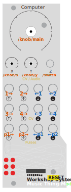

# Workshop Computer OSC CV Bridge

## Overview

This card and python allow you to run a bi-directional bridge translating OSC messages to and from CV on the [Music Thing Modular Workshop](https://www.musicthing.co.uk/workshopsystem/) computer.

OSC <-> Python server <-> Workshop Computer

All the inputs and outputs are used, and the 3 knobs and switch also send OSC messages.

Careful with the switch though - toggling it down halts the code and will mount the card so you can write a new uf2.

## Running

Write `wc_osc_bridge.uf2` to a card.

Start up the computer, you should get an LED pattern of 3 descending lines twice, which identifies the card.

Plug a USB lead from your computer into Computer.

I'm using `uv` to manage the python dependencies so [install uv](https://docs.astral.sh/uv/getting-started/installation/) if you've not got that.

Then:

`uv run wc_osc_bridge.py`

You should get output like:

```text
Scanning for Workshop Computer...
  candidate: /dev/cu.usbmodem101  (Pico)
Opening serial: /dev/cu.usbmodem101
OSC send → 127.0.0.1:7001  (WC inputs → OSC)
OSC recv ← 127.0.0.1:7000  (OSC → WC outputs)

Bridge running (send-on-receive, out=10B in=16B). Ctrl+C to quit.

  OSC config:
    Client (sends to bridge):  IP 127.0.0.1  Port 7000
    Server (receives from bridge):  IP 127.0.0.1  Port 7001
```

If you can't connect, power cycle the workshop and try again.

## Using

You can now send OSC messages to 127.0.0.1 port 7000 and receive them on port 7001.

All the computer outputs are used.

| OSC Address | Output | Notes |
|---|---|---|
| `/ch/1` | Audio Out 1 | SPI DAC, 12-bit, 48kHz — best for LFO/continuous CV |
| `/ch/2` | Audio Out 2 | SPI DAC, 12-bit, 48kHz |
| `/ch/3` | CV Out 1 | PWM, 11-bit, best for V/oct |
| `/ch/4` | CV Out 2 | PWM, 11-bit |
| `/pulse/1` | Pulse Out 1 | GPIO, digital — gates/triggers, threshold > 0V |
| `/pulse/2` | Pulse Out 2 | GPIO, digital |

And inputs:

| Input | OSC Address | Notes |
|---|---|---|
| Audio In 1 | `/ch/1` | |
| Audio In 2 | `/ch/2` | |
| CV In 1 | `/ch/3` | |
| CV In 2 | `/ch/4` | |
| Main knob | `/knob/main` | 0.0–1.0 |
| X knob | `/knob/x` | 0.0–1.0 |
| Y knob | `/knob/y` | 0.0–1.0 |
| Switch | `/switch` | 0=down, 1=middle, 2=up |
| Pulse In 1 | `/pulse/1` | 1.0 or 0.0 |
| Pulse In 2 | `/pulse/2` | 1.0 or 0.0 |

## VCV Rack 2

I've been using this with [VCV Rack 2](https://vcvrack.com/Rack)

Install the [cvOSCcv module](https://library.vcvrack.com/trowaSoft/cvOSCcv) and set the "Send Frequency" to 1000Hz.

Press `config` and then `enable`.

Patch some CV from your virtual rack to the inputs and it'll come out of the CV on your workshop computer. Patch the outputs of cvOSCcv into your virtual rack and control that from your workshop.

You'll need to press the config button on cvOSCcv to change some of the paths to e.g. `/knob/main` on the output side, or `/pulse/1/` on the input side.

## Source

https://github.com/andym/Workshop-Computer-OSC-CV-Bridge

Please raise pull requests, issues etc here.

## Thanks

As ever to Tom for the Workshop and Chris for ComputerCard.


